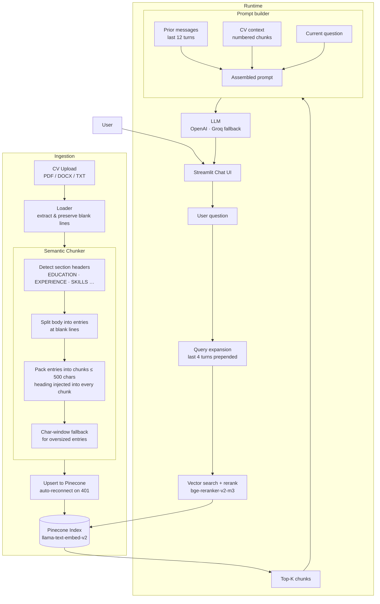

# CV RAG Chatbot

Practical Assignment #2 — A Retrieval-Augmented Generation chatbot that answers
questions about an uploaded CV.

- **UI**: Streamlit
- **Vector DB**: Pinecone with integrated embeddings (`llama-text-embed-v2`)
- **Reranker**: `bge-reranker-v2-m3`
- **LLM**: OpenAI GPT (default, `gpt-4o-mini`) with automatic fallback to Groq
  (`llama-3.3-70b-versatile`)
- **Document loaders**: PDF, DOCX, TXT

## Architecture



## Setup

1. Activate the virtual environment and install dependencies:

   ```bash
   source .venv/bin/activate
   pip install -r requirements.txt
   ```

2. Configure `.env` (already contains `PINECONE_API_KEY` and `GROQ_API_KEY`):

   ```env
   PINECONE_API_KEY=your_pinecone_key
   PINECONE_INDEX=cv-rag
   OPENAI_API_KEY=your_openai_key   # optional if you only want Groq
   GROQ_API_KEY=your_groq_key       # optional if you only want OpenAI
   ```

   At least one of `OPENAI_API_KEY` / `GROQ_API_KEY` must be set.

## Run

```bash
# Recommended: invoke the venv's streamlit directly so pyenv shims don't take over
.venv/bin/streamlit run app.py

# Equivalent alternatives:
#   .venv/bin/python -m streamlit run app.py
#   source .venv/bin/activate && hash -r && streamlit run app.py
```

> If you see `ModuleNotFoundError: No module named 'docx'` (or similar) after
> `pip install -r requirements.txt`, it almost always means `streamlit` was
> resolved to a pyenv/global shim instead of the venv. Use one of the commands
> above. Verify with `which streamlit` — it should point to `.venv/bin/streamlit`.

Then in the browser:

1. Upload a CV (PDF, DOCX, or TXT) from the sidebar.
2. Wait for indexing (the index is auto-created on first run).
3. Ask questions in the chat input — the chatbot remembers the conversation.

Each assistant reply has an expandable "Retrieved context" panel showing the
chunks fetched from Pinecone, their scores, and chunk indices.

## Project layout

```
app.py                # Streamlit entrypoint
rag/
  __init__.py
  loader.py           # PDF / DOCX / TXT extraction; preserves blank lines
  chunker.py          # Semantic CV chunker: section-aware, heading-injected chunks
  pinecone_store.py   # Idempotent index bootstrap, upsert, search + rerank;
                      # auto-reconnect on 401 (stale cached index handle)
  llm.py              # OpenAI / Groq abstraction with automatic fallback
  prompts.py          # Prompt builder with conversation history injection
requirements.txt
.env                  # API keys (gitignored)
```

## Notes

- Each uploaded CV gets its own Pinecone namespace derived from a SHA-1 of its
  bytes (`cv_<hash>`), so re-uploading the same file is a no-op.
- The Pinecone index is created on first launch using
  `create_index_for_model(model="llama-text-embed-v2", field_map={text: content})`
  on `aws/us-east-1`. No manual setup needed.
- Search retrieves `top_k * 2` candidates and reranks with `bge-reranker-v2-m3`.
- After upsert, the app waits 10 seconds before allowing the first query to
  ensure consistency.
- **Conversation memory**: the last 12 turns are injected into the prompt so the
  model can handle follow-up questions. The last 4 turns are also prepended to the
  vector search query to improve recall for pronoun/reference resolution.
- **Semantic chunking**: the chunker detects CV section headers (ALL-CAPS or
  ~30 known title-case headings) and injects the heading into every chunk, so
  retrieval always returns self-contained, contextualised excerpts.
- **Stale index recovery**: if you delete the Pinecone index while the app is
  running, operations auto-retry once after refreshing the index handle. A manual
  **Reconnect to Pinecone** button is also available in the sidebar.
