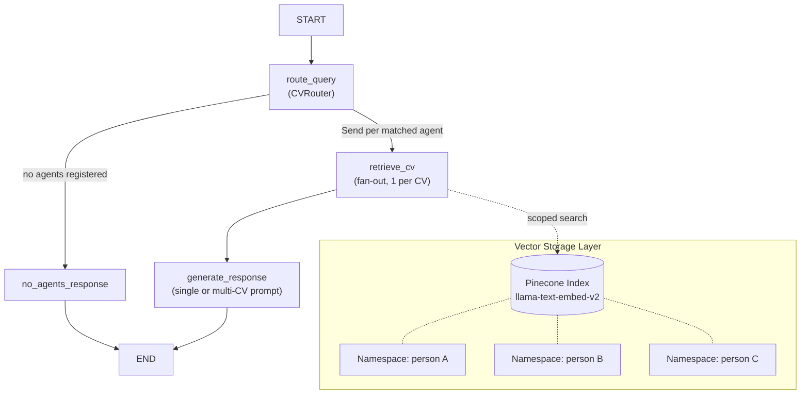

# Multi-Agent CV RAG Chatbot

Practical Assignment #2 — A Retrieval-Augmented Generation chatbot that supports
one CV agent per person and routes each question to the correct CV context.

- **UI**: Streamlit
- **Agent framework**: LangGraph (`StateGraph` with conditional edges and `Send` fan-out)
- **Vector DB**: Pinecone with integrated embeddings (`llama-text-embed-v2`)
- **Reranker**: `bge-reranker-v2-m3`
- **LLM**: OpenAI GPT (default, `gpt-4o-mini`) with automatic fallback to Groq
  (`llama-3.3-70b-versatile`)
- **Document loaders**: PDF, DOCX, TXT

## Routing behavior

- If the query mentions one person, route to that person's CV agent.
- If the query mentions multiple people, retrieve from all matching CV agents and
  synthesize a combined answer.
- If no person is mentioned, route to the default CV agent (student CV).
- If retrieved context is insufficient, the assistant must say the information is
  not available in the CV.
- Answers must be grounded in retrieved context (no hallucinated facts).

## Architecture (LangGraph StateGraph)

The orchestration pipeline is modelled as a LangGraph `StateGraph`. Each step
is an explicit node; routing uses conditional edges with dynamic fan-out via
the `Send` API so that N agents are queried in parallel.



## Setup

1. Activate the virtual environment and install dependencies:

   ```bash
   source .venv/bin/activate
   pip install -r requirements.txt
   ```

2. Configure `.env`:

   ```env
   PINECONE_API_KEY=your_pinecone_key
   PINECONE_INDEX=cv-rag
   OPENAI_API_KEY=your_openai_key   # optional if you only want Groq
   GROQ_API_KEY=your_groq_key       # optional if you only want OpenAI
   ```

   At least one of `OPENAI_API_KEY` / `GROQ_API_KEY` must be set.

## Run

```bash
.venv/bin/streamlit run app.py
```

If `streamlit` resolves to a global shim, use:

```bash
.venv/bin/python -m streamlit run app.py
```

## How to use

1. In the sidebar, fill:
   - **Person name**
   - **Aliases** (optional, comma-separated)
   - **Set as default (student CV)** for the fallback agent
2. Upload a CV file (`pdf`, `docx`, `txt`) and click **Index / update CV**.
3. Repeat for each person.
4. Ask questions in chat (individual or comparative).

Each assistant message includes expandable retrieved context per selected agent.

## Suggested test queries

- `What experience does Juan have?`
- `Tell me about Maria's education.`
- `Compare Juan and Maria in terms of Python experience.`
- `Who has more experience with machine learning?`
- `What projects has this person worked on?` (should use default agent)

## Project layout

```text
app.py                # Streamlit entrypoint (UI + orchestration wiring)
rag/
  __init__.py
  loader.py           # PDF / DOCX / TXT extraction; preserves blank lines
  chunker.py          # Semantic CV chunker: section-aware, heading-injected chunks
  pinecone_store.py   # Pinecone index bootstrap, upsert, namespace search + rerank
  llm.py              # OpenAI / Groq abstraction with automatic fallback
  prompts.py          # Prompt builder for single-agent CV answering
  multi_agent.py      # AgentRegistry, CVRouter, LangGraph StateGraph, run_graph()
requirements.txt
.env                  # API keys (gitignored)
```

## Notes

- The system uses one Pinecone index with one namespace per person/CV.
- Search retrieves `top_k * 2` candidates and reranks with `bge-reranker-v2-m3`.
- Conversation memory is used for follow-up disambiguation.
- If the Pinecone index is deleted while running, use **Reconnect to Pinecone**.
